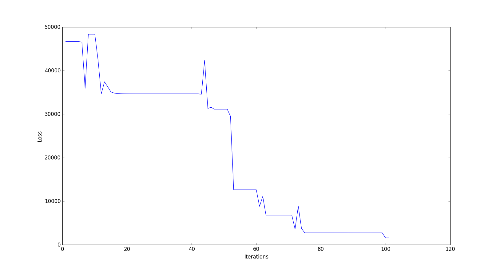

# Gesture-Recognition-CNN

## Cotents
[About](#about)  
[The Project](#the-project)  
[The Process](#the-process)  
[Data Collection](#data-collection)  
[Data Preprocessing](#data-preprocessing)  
[CNN Model](#cnn-model)  
[Implementation](#implementation)  
[Results](#results)

## About

This Project was made to understand the concept of CNN and to learn about the various layers of CNN. This project is purely done in numpy (no modules even for backpropogation)

## The Project

The project basically recognizes gestures from one of the below gestures
* FIST
* HAND
* ONE
* PEACE

## The Process

* First the data is generated from scratch using image processing
* The data is cleaned and a split is made, later the model is pickled
* CNN model is built using only numpy
* Model with different parameters are trained on google cloud
* Models are compared

## Data Collection

OpenCv is used for image processing, live video was captured via video camera, then with each frame  
* Image is converted in gray scale
* Gaussina blur is applied
* Mask is applied
* Image is dilated and eroded
* Median blur is applied and the image is saved

The final image that was saved was a 50x50 gray scaled image

The images can be found in the images_data folder

#### Images from the dataset
  
**Fist**

  
**Hand**

  
**One**

  
**Peace**

Here is the [link](image_data_maker.py) for the data generation code

## Data Preprocessing
This step preprocesses the data i.e normalizing and splitting the data into train, test, validation. The split ratio is 70%,20%,10% repectively. The data is later pickled so as to load the object directly  
The preprocessing code can be seen [here](img_preprocess.py)

Total data points (approx)  
train - 3000  
validation - 500  
test - 1000
## CNN Model

This section describes the architechture used, the next section explains the parameters in detail and how the model was trained on the cloud  
The model consisted of two CONV BOX followed by a fully connected layer with two hidden layer  

One CONV BOX consists of three layers  
**Convolution Operation -> Relu -> Max Pooling**  
So, this operation was carried out twice

**Convolution operation** was calculated using the numpy's fast fourier transform  
**Max Pooling** was implmented by using loops and some fancy array slicing

After Conv box, Fully connected layer was attached - fully connected layer consists of two hidden layers

The Entry point to the class is the train function

The CNN Model class can be viewed [here](cnn_model.py)  

Links used to learn CNN  
* https://www.youtube.com/watch?v=FTr3n7uBIuE
* http://cs231n.github.io/convolutional-networks/
* https://ujjwalkarn.me/2016/08/11/intuitive-explanation-convnets/  
* http://colah.github.io/posts/2014-07-Conv-Nets-Modular/  
* http://andrew.gibiansky.com/blog/machine-learning/convolutional-neural-networks/

Backpropogation  
* http://cs231n.github.io/optimization-2/  
* https://grzegorzgwardys.wordpress.com/2016/04/22/8/
* https://www.slideshare.net/kuwajima/cnnbp
* http://www.jefkine.com/general/2016/09/05/backpropagation-in-convolutional-neural-networks/

## Implementation

This section provides some Implementation notes.
* Implemented Dropout to avoid overfitting
* Applied gradient check to verify the gradient update
* Used scipy optimize class to minimize the loss function
* Xavier initialization for initial guess of parameters
* Trained the model parallely accross different cores (using joblib)

Trained the model on [Google cloud platform](https://cloud.google.com/)  

Google Compute Engine Configurations  
* Ubuntu 16.04
* 8 CPUs
* 50Gb ram

Once the model was trained it was pickled and [this](cnn_predict.py) code is used to predict the gesture

## Results
All the parameters related to the model trained was written in [params file](params.json), the value of the parameters was read during the run time  
Around **15 models were trained**, I will be comparing here **4 models**, based on the major changes

|No.| # Kernels L1 |Dimension L1| # Kernels L2 | Dimension L2 | # Hidden Nodes L1 | # Hidden Nodes L2 | Optimization Method | Validation Accuracy % |
|---|:-------------:|:-------------:|:-------------:|:-------------:|:-------------:|:-------------:|:-------------:|-------------:|
|1|3|2x2|4|4x4|300|150|TNC|16.04|
|2|16|9x9|32|7x7|800|400|L-BFGS|22.32|
|3|32|9x9|64|5x5|3000|1500|BFGS|60.67|
|4|32|3x3|64|5x5|1800|900|TNC|95.71|

**Note - training time for every model is 4+ hours**

The 4th model in the table gave the best results, currently params.json contains the parameters of the best model  
The model was trained for 100 iterations

Below is the figure showing the loss vs iterations curve for the best model

Finally the model was tested on the test set and the **accuracy was 95.06%**

Also the model was tested on live feed of the web cam it was giving impressive results, one peculiar observation was that the model was getting confused between hand and the fist
